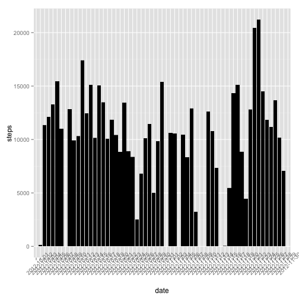
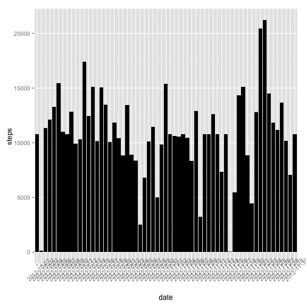
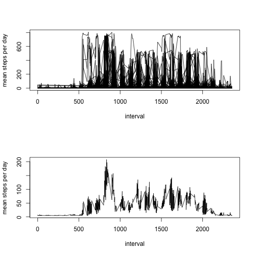

## The data was downloaded from the web (url:"https://d396qusza40orc.cloudfront.net/repdata%2Fdata%2Factivity.zip") and stored in the "PeerAssessment 1" folder. 

## Loading and preprocessing the data

```r
setwd("~/RepData_PeerAssessment1")
unzip("repdata-data-activity.zip", exdir =".", unzip = "internal", setTimes = TRUE)
myfile <- read.csv("activity.csv")
library(dplyr) 
library(ggplot2)
mytable <- myfile %>% group_by(date, interval) %>% summarise(steps= sum(steps))
p1 <- ggplot(data = mytable) + 
aes(x = date, y = steps)+
geom_histogram(stat = "identity", fill = "black")
 p1 + theme(axis.text.x = element_text(angle = 45))
```

```
## Warning: Removed 2304 rows containing missing values (position_stack).
```

 

```r
 meanstepspd <- mytable %>% group_by(date) %>% summarise(steps= mean(steps))
 summary(meanstepspd)
```

```
##          date        steps        
##  2012-10-01: 1   Min.   : 0.1424  
##  2012-10-02: 1   1st Qu.:30.6979  
##  2012-10-03: 1   Median :37.3785  
##  2012-10-04: 1   Mean   :37.3826  
##  2012-10-05: 1   3rd Qu.:46.1597  
##  2012-10-06: 1   Max.   :73.5903  
##  (Other)   :55   NA's   :8
```
 ## The mean steps per day is 10766 and median is 10765. 
 
 ## What is the average daily activity pattern?
 
 ## Average steps taken per day 
 mytable2 <- myfile %>% group_by(interval, date) %>% summarise(steps = mean(steps))
 plot(mytable2$interval, mytable2$steps, xlab = "interval", ylab = "mean steps per day",  type = "l")
 summary(mytable2)
 
 ##  as in the summary of mytable2, we get the maximum number of steps taken in an interval is 806. It is confirmed by 
 
 ```r
 max_steps <- max(mytable2$steps, na.rm = TRUE)
 ```
 
 ```
 ## Error in eval(expr, envir, enclos): object 'mytable2' not found
 ```
 
 ```r
 max_steps
 ```
 
 ```
 ## Error in eval(expr, envir, enclos): object 'max_steps' not found
 ```
 
 ## The corresponding 5-minute interval is 615, as detected by :
 
 ```r
 mytable2$interval[match(806, mytable2$steps)]
 ```
 
 ```
 ## Error in eval(expr, envir, enclos): object 'mytable2' not found
 ```
 ## Imputing missing values
For simplicity, the missing values for the steps are replaced with the mean steps/interval as follows
 
 ```r
 newtable <- mytable ## makes a copy the original data
 replacement <- mean(mytable$steps, na.rm = TRUE) ## calculates the mean for steps to be used as replacement
 newtable$steps[is.na(newtable$steps)] <- replacement ## replaces the missing values with the replacement value
 miss_val <- sum(is.na(newtable$steps))  ## to confirm there is no missing value
 miss_val
 ```
 
 ```
 ## [1] 0
 ```
 
 ```r
 p2 <- ggplot(data = newtable) +             ## plotting the histogram
 aes(x = date, y = steps)+
 geom_histogram(stat = "identity", fill = "black")
 p2 + theme(axis.text.x = element_text(angle = 45))
 ```
 
  
 ## The mean and median steps are 
 
 ```r
 newmeansteps <- mean(newtable$steps)
 newmediansteps <- median(newtable$steps)
 print(c(newmeansteps,newmediansteps))
 ```
 
 ```
 ## [1] 37.3826  0.0000
 ```
  
 ## to compare the mean, median and other features in the two tables
 
 ```r
 summary(mytable)
 ```
 
 ```
 ##          date          interval          steps       
 ##  2012-10-01:  288   Min.   :   0.0   Min.   :  0.00  
 ##  2012-10-02:  288   1st Qu.: 588.8   1st Qu.:  0.00  
 ##  2012-10-03:  288   Median :1177.5   Median :  0.00  
 ##  2012-10-04:  288   Mean   :1177.5   Mean   : 37.38  
 ##  2012-10-05:  288   3rd Qu.:1766.2   3rd Qu.: 12.00  
 ##  2012-10-06:  288   Max.   :2355.0   Max.   :806.00  
 ##  (Other)   :15840                    NA's   :2304
 ```
 
 ```r
 summary(newtable) 
 ```
 
 ```
 ##          date          interval          steps       
 ##  2012-10-01:  288   Min.   :   0.0   Min.   :  0.00  
 ##  2012-10-02:  288   1st Qu.: 588.8   1st Qu.:  0.00  
 ##  2012-10-03:  288   Median :1177.5   Median :  0.00  
 ##  2012-10-04:  288   Mean   :1177.5   Mean   : 37.38  
 ##  2012-10-05:  288   3rd Qu.:1766.2   3rd Qu.: 37.38  
 ##  2012-10-06:  288   Max.   :2355.0   Max.   :806.00  
 ##  (Other)   :15840
 ```
 ## The mean steps per day is 10766 and median is 10766. 
 ## There is no change in the mean. The median changes by 1 step only. 
 ## There is no significant impact for imputing the missing data on the estimates of the total daily number of steps.
 
 
 ##  Are there differences in activity patterns between weekdays and weekends?
 
 ```r
 datetable <- mutate(newtable, day= as.Date(date))
 stepsdate <- select(datetable, interval, steps, day)
 stepsdateday <- mutate(stepsdate, WEEKDAY = weekdays(day))
 stepsdateday$WEEKDAY <- factor(stepsdateday$WEEKDAY)
 days <- list(weekend = c("Saturday", "Sunday"), weekday= c("Monday", "Tuesday", "Wednesday", "Thursday", "Friday"))
 levels(stepsdateday$WEEKDAY) <-days
 weekdayactivity <- stepsdateday %>% group_by(interval, WEEKDAY) %>% summarise(steps = mean(steps))
 meanweekdayactivity <- weekdayactivity %>% group_by(WEEKDAY) %>% summarise(steps = mean(steps))
 meanweekdayactivity
 ```
 
 ```
 ## Source: local data frame [2 x 2]
 ## 
 ##   WEEKDAY    steps
 ##    (fctr)    (dbl)
 ## 1 weekend 42.36640
 ## 2 weekday 35.61058
 ```
 ## Average number of steps taken in weekend is 42.366 and the same on weekday is 35.610. A slightly higher activity in the weekend. 
 
 
 ```r
 par(mfrow = c(2, 1))
 plot(mytable$interval, mytable$steps, xlab = "interval", ylab = "mean steps per day",  type = "l")
 plot(weekdayactivity$interval, weekdayactivity$steps, xlab = "interval", ylab = "mean steps per day",  type = "l")
 ```
 
  
